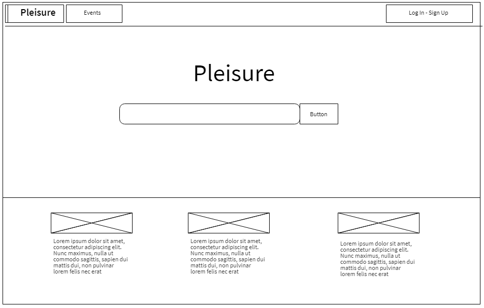
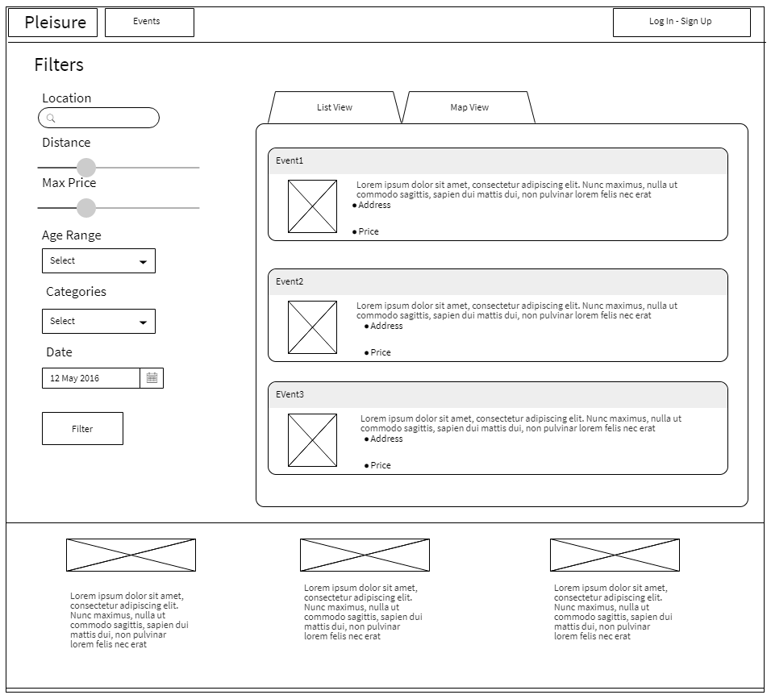
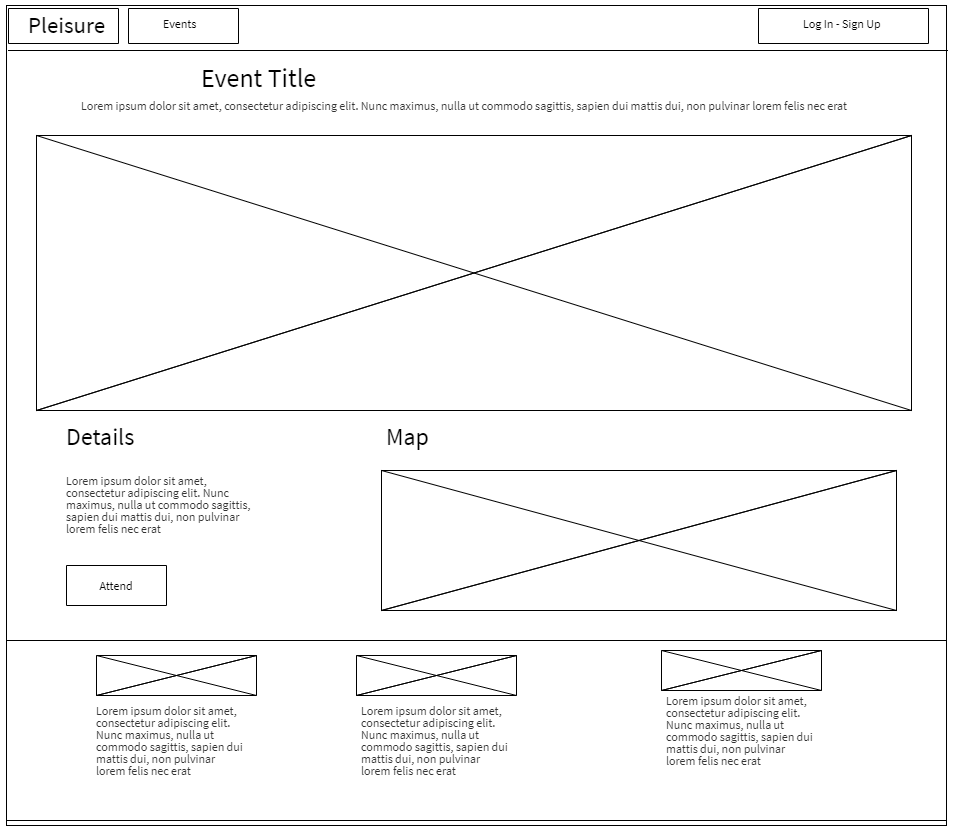
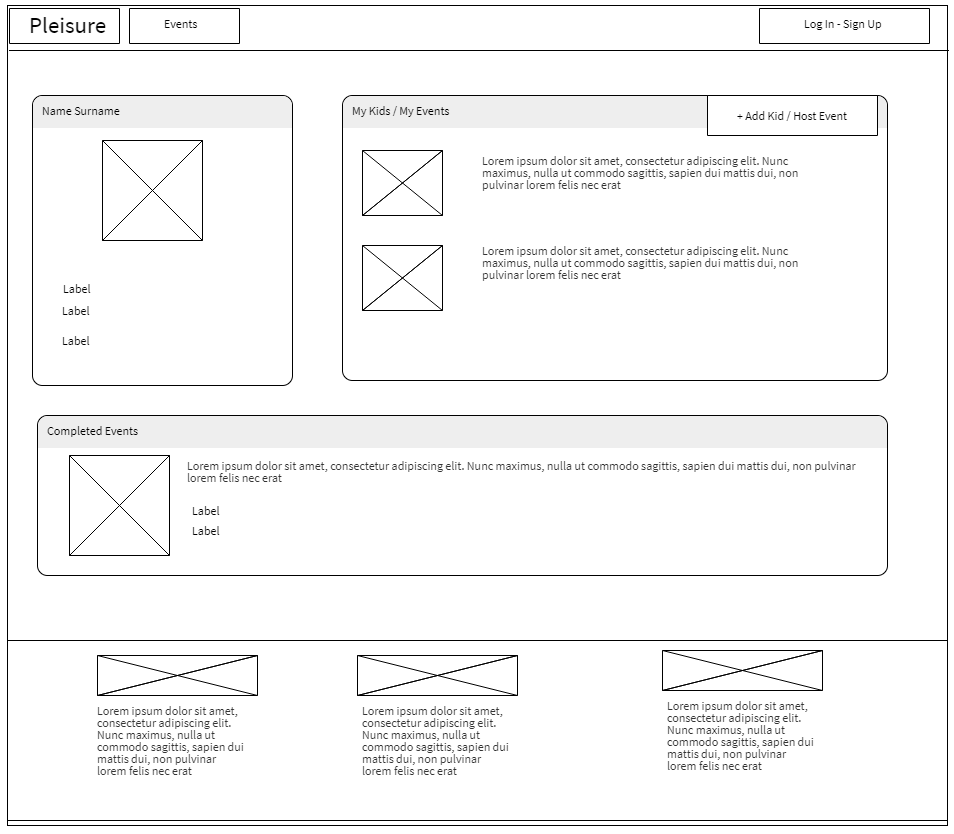
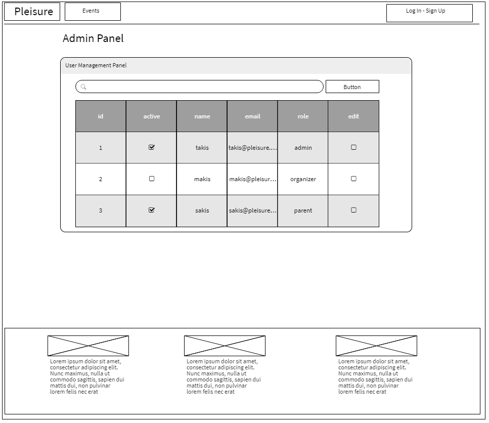

# 'Pleisure' Platform

## Software Description

Pleisure is a web platform which connects parents with activities providers for their children. It aims to offer parents the capability of finding high quality activities for their kids via a simple and easy to use user interface. 

At the same time, it provides a handy environment for corresponding services and businesses for advertising and reaching out to more potential customers.

## Requirements Analysis

### Functional Requirements

#### User Groups and corresponding operations

The users of the platform can belong to one of the following groups:

1. Guest users
2. Parents
3. Organizers
4. Administrators

Guest users have access to most of the content of the platform. They can view, without the need to login, all the events that are available, with priority to those hosted near them by submitting their area of interest. They can also apply filters, to limit the events displayed and adjust the search to their preferences. However, they cannot book events.

Parents are the users that are logged in as such. They can perform all the actions that a Guest user can, plus they have access to a private profile page where they can add information and photos, and can also buy credits (see [Monetization](#monetization)). In this personal page there is also an option to "add child", via which, a parent can add information about his children (such as date of birth and prefered activity), so that the events displayed in the search results will have pre-applied filters accordingly for quicker personalization.

Organizers are the activity/events providers. They can perform all the actions that Guest users can too, and also create events. Their "profile page" is similar to this of the "parent" user, but instead of "add child" option, they have the "add event" option, where they can fill out a special form with details to publish the event. These details include the exact time and date of the event, info about it being reccuring or not, its pricing, address (geolocation), photos etc. They can also view monthly reports in their profile page, with all the completed events, total respective number of tickets sold and total income for each event in EUR. 

Organizers should be oblidged to provide a bank account or an IBAN since they are not using the credits system, in order to get paid for their services.


Administrators are special users that can manage the registered users (Parents and Organizers). They can:

- Ban users, if they notice any violation of the Terms of Usage
- Restrict user functionality (such as event creation for an Organizer)
- Edit passwords

Authentication of all users (belonging to the groups Parents/Organizers/Administrators) is performed with the use of passwords that are set on each respective signup.

#### Entry Points

All the users visiting the web platform, can immediately utilise the functionality of the service by typing in the type of activity in the main textfield. 

The nearby events with matching tags are then displayed on another page, to which the user is redirected after performing the query action.

Else, by clicking the “Events” tab on the navbar they are getting redirected directly to the event page, where they can browse events and apply filters.

#### Monetization

The platform uses an internal currency system. 

More specifically, different types of users can interact financially with each other by using "credits". "Parents" can buy credits via PayPal, and use these tokens to pay the "Organizers" for the chosen activities. 

The amount of credits is bound to the user's account, and no further kind of transactions are supported. Also, refunds and cancelling of transactions are not supported.

Moreover, the website's owner can profit by keeping a commission for every transaction fulfilled.

#### Booking events

Events can be booked by parents with the use of 'credits'. Upon booking the event, the ticket is presented and then emailed to the corresponding 'parent' user as a pdf file.

### Event Search and Results Filtering

As mentioned before, 'Pleisure' offers a simple search engine on the website's main page. This aims to enable every user, to narrow the list of given events, so that it matches their needs and prefernces. The user types in an activity and the corresponding events are shown immeditely without having to browse through all website's events.

'Pleisure' provides further result filtering on the Events page. In order to use the filtering tool a location must be provided by the user. Given that, the user limits  the event shown results by adjusting:

- Distance from the given location
- Maximum Price of the event
- Age Range of the participants
- Activity Category
- Date of the event

The events are displayed in two ways, either of which can be active at any time by selecting the corresponding tab. They can be displayed in the form of a scrollable list, or in a map, as marked points which can be examined and/or clicked upon for redirection to the event page for further details and booking.

### Non-functional Requirements

#### Legal

##### Software license

The software is licensed under the MIT License:

> Copyright (c) 2017 Pleisure

> Permission is hereby granted, free of charge, to any person obtaining a copy
> of this software and associated documentation files (the "Software"), to deal
> in the Software without restriction, including without limitation the rights
> to use, copy, modify, merge, publish, distribute, sublicense, and/or sell
> copies of the Software, and to permit persons to whom the Software is
> furnished to do so, subject to the following conditions:

> The above copyright notice and this permission notice shall be included in all
> copies or substantial portions of the Software.

> THE SOFTWARE IS PROVIDED "AS IS", WITHOUT WARRANTY OF ANY KIND, EXPRESS OR
> IMPLIED, INCLUDING BUT NOT LIMITED TO THE WARRANTIES OF MERCHANTABILITY,
> FITNESS FOR A PARTICULAR PURPOSE AND NONINFRINGEMENT. IN NO EVENT SHALL THE
> AUTHORS OR COPYRIGHT HOLDERS BE LIABLE FOR ANY CLAIM, DAMAGES OR OTHER
> LIABILITY, WHETHER IN AN ACTION OF CONTRACT, TORT OR OTHERWISE, ARISING FROM,
> OUT OF OR IN CONNECTION WITH THE SOFTWARE OR THE USE OR OTHER DEALINGS IN THE
> SOFTWARE.

##### Cookies Policy

Users can instruct their browsers to refuse all cookies or to indicate when a cookie is being sent. However, if they do not accept cookies, they will not be able to use some portions of the service.

#### Security

The software implements all the security standards to prevent SQL injection attacks, XSS, and user accounts leak from the database.
Sessions are over TLS so all communication with the server is encrypted.
The sensitive data of the users (such as information about the children of the "parent" users) are visible only to the user himself and the Administrator users.

Furthermore, since the application is going to handle a currency-like system as well as paid event booking, security coherency and fault tolerance are also big concerns.

#### Usability

The User Interface is the simplest possible, so that even inexperienced users can have full experience of the functionality of the service. It features easy navigation for all user groups.

#### Flexibility

The software can be deployed on any platform that can run .NET >= 4.6 or Mono >= 5.4 and a MySQL database.

It can easily be managed through an Administrator account with no need for technical skills or low-level access.

#### Deployment

The installation procedure (both building and deployment) will aim to be as automated as possible with the use of a script.

#### Responsiveness

The UI is responsive, meaning it offers optimal viewing experience across a wide range of devices (Desktop, Tablet, Mobile).

The forms and interactions with the page will utilize the asynchronous properties of web-development languages, so that time-consuming tasks can run in the background without making the page unresponsive.

## Technical Specifications

### Architecture and Design

The development stack has been arranged as follows:

- Database: **MySql**
	- The relational model, generally suits well any application that does not work with any Artificial Intelligence technologies, or any form of data that is otherwise sparsely defined and/or distributed. Therefore, it became apparent that the application's back-end storage would be within the SQL family. Within that set of languages, MySql was pretty straight-forward choice as it is free, flexible, easy to set up or use and widely supported in any programming language by numerous libraries and functions.
- Web-Server: **C#**
	- Although the choice here was mostly preferential, it is a strong one, as the .NET Framework is very versatile, robust and agile in development. This language is further supported by Microsoft's own Visual Studio, which makes any workflow effortlessly streamlined and optimized.
	- For any interaction between the web server and the application, the former will provide a JSON API for data retrieval, as well as any operation the user might intend to perform through the application, for example booking an event or changing their password.
- Front-End: **HTML, CSS, Javascript**
	- As this is a web application, the default W3C set of languages has been chosen to both design and render the application. Any alternatives would involve the use of specialized front-end rendering frameworks, which were deemed to be beyond the scope of the project. Describing the application natively in the web languages also ensures abstraction, making the front-end of the project not have any major dependency on any other parts of stack.

### Frameworks / Libraries

#### Back-End

- [Newtonsoft.Json](https://www.newtonsoft.com/json)
	- The choice of this library has become pretty obvious when it comes to web applications that communicate over APIs. In our case, the communication between the web page and the web server is done via asynchronous HTTP requests and all the messages are in JSON format, thus making this library almost necessary.
- [HaathDB](https://git.gmantaos.com/Haath/HaathDB)
	- This library extends - and depends on - the official [MySql.Data](https://www.nuget.org/packages/MySql.Data/). Offering significant simplification and abstraction over basic database functions, through serialization, this library - in most cases - eliminates the need for most additional development when integrating C# with MySql.
- [Watermark](https://bitbucket.org/teamdroptabel/watermark)
	- The other part of this project, a library that will be used to watermark images provided by event organizers. Its function will be to protect them from copyright theft, which can happen on a platform such as this one.
	- The releases of this project are hosted on a [private NuGet server](https://nuget.gmantaos.com/?specialType=singlePackage&id=ProgTech.Watermak).
- [Chance.NET](https://github.com/gmantaos/Chance.NET)
	- This library will not see any use during the deployment of the application. It's a randomness generation which will be used during development, by generating large amounts of fake data for testing purposes.

#### Front-End

- [jQuery](https://jquery.com/)
	- This leading library in DOM parsing and manipulation, will be utilized for just about every function of the website. Using its AJAX capabilities for asynchronous http requests, as well as its high-level methods for document event handling, each and every page will be designed to be fast and responsive.
- [Bootstrap 3](https://getbootstrap.com/)
	- Bootstrap will be used mostly for designing the responsive layout of the pages but also for providing certain functionalities, like pop-up windows.


### Wireframes

The wireframes describing the user interface, for the most basic pages of the platform are shown below:

Home Page:



Events Page:



Event Page:



Profile Page:



Admin Panel:



For other functionalities (LogIn/SignUp, Add Event, Add Kid, Add Funds etc.) we use modals (popup dialog boxes), and not dedicated pages in order to avoid many redirections and keep the UI simple.

### System Requirements

#### Environment

The web server can run in either one of the following environments with their respective dependencies

- Microsoft Windows
	- .NET Framework 4.6 or higher
- Any unix distribution
	- Mono Framework 5.4 or higher
- Any unix distribution
	- Docker

The web server can be built in either one of the following environments with their respective dendencies

- Microsoft Windows
	- NuGet
	- MSbuild
- Any unix distribution
	- NuGet
	- xBuild
- Any unix distribution
	- Docker

The application also requires a stable connection to a `MySql server`.

#### Hardware requirements

The application itself has a small memory footprint and is linearly scalable. The application has to store the high-resolution images that the organizers will upload and thus has a significant requirement for storage.

### Build & Deployment

The project's deployment will revolve around [Docker](https://www.docker.com/). A linux bash script will be used to automate the process, which will do the following:

1. Pull the source code from the repository.
2. Build the project using a Makefile which in summary does the following
	1. Use `nuget restore`, which will download all the dependencies of the solution.
	2. Use `xbuild`, which is a clone of the official `MSBuild`, to build all projects in the solution in the correct order using the *Release* configuration.
3. Build the docker image from the `Dockerfile` which in summary does the following
	1. Use an image that has `mono-complete` installed.
	2. Copies the build folder `Pleisure/bin/Release/` to `/opt/Pleisure` inside the container
	3. Runs the web server as the image's entrypoint using the command `mono /opt/Pleisure/Pleisure.exe`

Additionally, any options that need to be passed to the application, such as the credentials for the MySql server for example, will be passed when running the container in the form of environment variables, like the following example

```bash
docker run \
	-e MYSQL_HOST=172.17.0.1 \
	-e MYSQL_USER=progtech \
	...
```

#### Monitoring

As the application will run in a Docker container, there are plenty of ways to monitor its status and performance

The following command will follow the stdout of the web server running inside the container

```bash
docker logs -f pleisure
```

The following command will provide diagnostic information on the running container

```bash
docker stats pleisure

CONTAINER           CPU %               MEM USAGE / LIMIT     MEM %               NET I/O             BLOCK I/O           PIDS
pleisure           0.00%               95.36MiB / 923.4MiB   10.33%              10MB / 11.5MB       58.5MB / 1.62MB     0
```

#### Notes on security

- Storage of the passwords in the database is done after hashing them with 'salt' to prevent any leak (in case of database attack)
- The server can run over TLS and a certificate can be provided.


